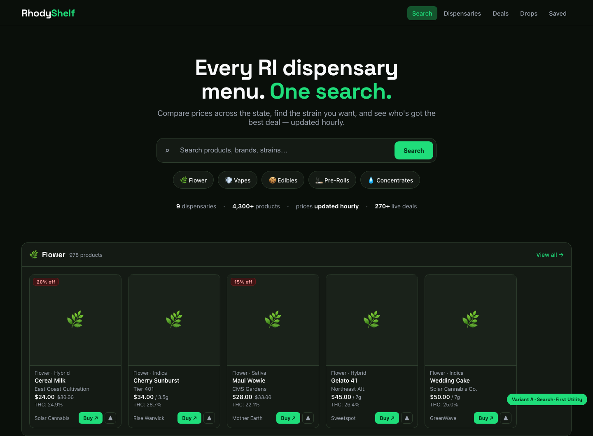
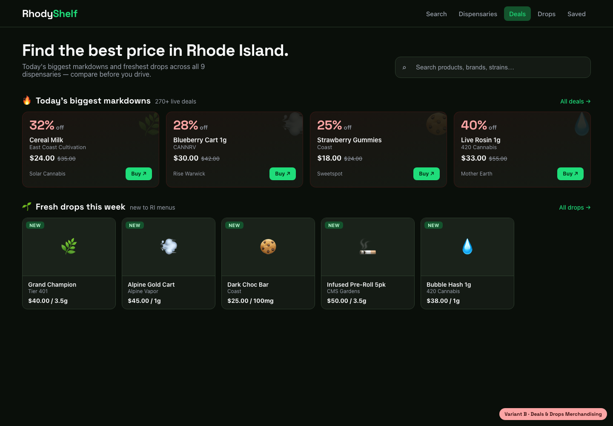
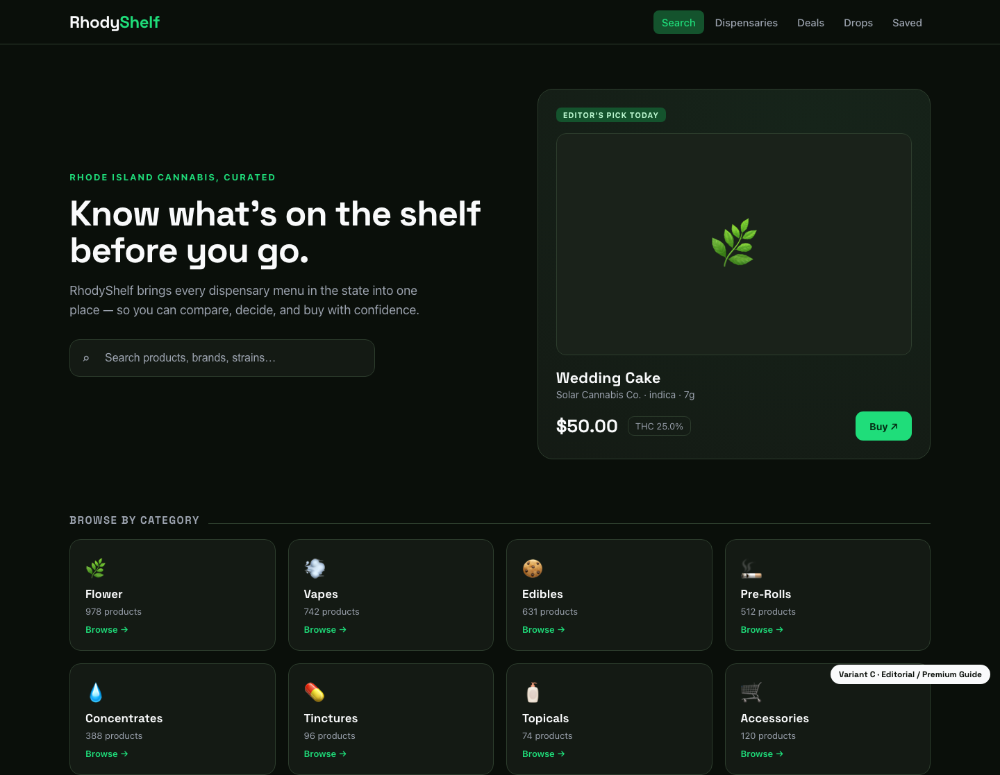
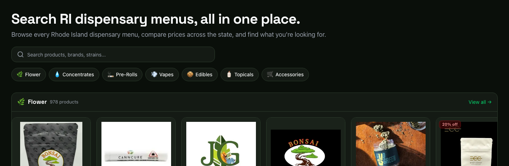

# Home page — design direction exploration

A `/design-shotgun` pass on the flagship screen (the home page). Three distinct
directions were mocked up against the real design tokens (dark green, Space
Grotesk headings, the existing card language), rendered in a headless browser,
and compared side by side.

**The memorable thing this product should own:** *every Rhode Island dispensary
menu, searchable in one place.* Every call below is judged against that.

> Mockups are static HTML built from the live tokens — directional, not
> pixel-final. Source + comparison board live in
> `~/.gstack/projects/<slug>/designs/shotgun-home/`.

---

## Variant A — Search-First Utility  ✅ recommended

Treats the hero as a poster: a confident headline, a large centered search bar,
quick-browse category chips, and a one-line trust/scale stat row — then the
existing product rows. Leans all the way into the core promise.

- **Pros:** Puts the one-search promise front and center. Fills the currently
  sparse desktop hero. Keeps the strong streaming-style product merchandising.
  Every new element is low-risk and reversible.
- **Cons:** Evolution, not reinvention — won't wow anyone looking for a dramatic
  redesign (which is the right trade-off for a live utility).

## Variant B — Deals & Drops Merchandising

Leads with savings: a "today's biggest markdowns" strip and a "fresh drops"
rail above the category rows.

- **Pros:** Energetic, money-forward, rewards return visits.
- **Cons:** Largely duplicates the existing `/deals` and `/drops` pages, and
  narrows the home story to "deals" instead of "search every menu." Better kept
  as a section *within* the home than as the lead.

## Variant C — Editorial / Premium Guide

A calm, magazine-style hero with an "editor's pick" feature card and a refined
category tile grid.

- **Pros:** Looks the most premium; generous whitespace.
- **Cons:** "Editor's pick" implies human curation the automated aggregator
  doesn't actually do (a promise it can't keep), and the category-grid hero
  drops the product-row merchandising that makes browsing feel alive.

---

## Decision

**Adopt Variant A, incrementally.** It serves the memorable thing best and
breaks down into small, independently-shippable pieces rather than a risky
big-bang redesign of a live site.

### Shipped in this PR
- **Quick-browse category chips** under the hero search. Server-rendered from
  the same `sections` shown below, so labels/counts never drift. Horizontally
  scrollable on mobile, wraps on desktop, keyboard-focusable with an on-brand
  focus ring.

  

### Recommended follow-ups (not in this PR)
- **Hero stat/trust row** ("9 dispensaries · 4,300+ products · prices refreshed
  daily · 270+ live deals"). Needs a cheap dispensary-count + deal-count query
  and an accurate freshness claim before shipping — don't overclaim "hourly."
- **Larger, centered hero search** treatment for the home page (keep the compact
  header search as-is).
- Fold the **deals/drops strips** from Variant B in as home sections *below* the
  category rows, not as the lead.
